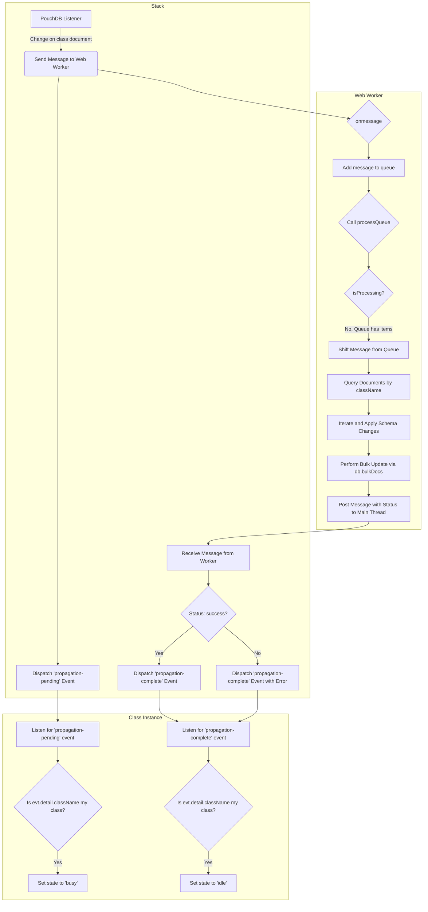

# Structure and propagation

## Handling data model updates
### Adding an attribute
When a class is created, it has no attribute defined within its schema. In this scenario, adding an attribute involves:
<!-- todo -->

### Class data-model propagation
When there are alredy documents belonging to a specific class (`type == "ClassA"`), we expect that changes made to the class schema affects also the documents.
Therefore, Stack during initialization sets up a listener that watches out for updates on Class documents.

In this scenario a Web Worker will handle the task of propagating the updates on documents belonging to the modified class, since it's:
* Computationally Intensive: It involves querying a potentially large number of documents.
* I/O Bound: It requires reading data from the database and then writing it back.
* Not UI-Related: The task doesn't directly involve user interaction or rendering elements on the screen.

#### Why a Web Worker is the Right Choice
* Efficient Bulk Operations: A Web Worker is well-suited to perform the entire workflow:
    1. Querying for all documents of a specific class.
    2. Iterating through the results and applying the schema changes (adding, removing, or modifying properties).
    3. Writing the updated documents back to the database using PouchDB's bulkDocs method for maximum efficiency.
* Scalability: As the number of documents in a class grows, the time required for the update will increase. A Web Worker ensures that your application remains responsive regardless of the scale of the operation.

#### Understanding what's different
We use [jsondiffpatch](https://github.com/benjamine/jsondiffpatch) to differ and understand what changed in a datamodel. This information is useful to understand how it affects the documents.
The library produces a detailed patch object describing the changes between two JSON objects, including additions, removals, and modifications.
The `jsondiffpatch` operation should be done **within the Web Worker**.

Here's the reasoning from a developer's perspective, focusing on the architectural benefits and keeping your main thread responsive:

##### 1. Offload All CPU-Intensive Tasks

The primary purpose of your Web Worker is to offload computationally heavy operations. The `jsondiffpatch.diff()` function is a **synchronous** and **CPU-intensive** operation. If you were to perform this on the main thread, a very large schema could cause a brief but noticeable UI freeze.

By placing this logic inside the worker, you ensure that the entire, self-contained task—from fetching the necessary revisions to performing the diff and finally executing the bulk update—is handled on a separate thread.

##### 2. Simplify the Main Thread's Role

The main thread's only job should be to act as a lightweight coordinator. Its task is to:
1.  Listen for a change event.
2.  Send a simple, small message (`docId`, `previousRevId`) to the worker.
3.  React to the worker's completion message.

It doesn't have to concern itself with the complex and potentially slow task of fetching document revisions or diffing them. This keeps the main thread responsive and the application's overall architecture clean and modular.

##### 3. Minimize Communication Overhead

Sending large objects between the main thread and a Web Worker (which involves serialization and deserialization) can be slow. By performing the diff *inside* the worker, you only need to pass a minimal amount of data (`docId`, `previousRevId`) once, at the beginning. If you performed the diff on the main thread, you would have to send the large, diffed object (`schemaDelta`) to the worker, which is less efficient.

#### Base Flow
Here is a high-level overview:

1. Main Thread:

    * The Stack has a PouchDB listener that only listens for changes on documents with type == "class". This listener is lightweight and fast.
    * When a class document is updated, the Stack will instantiate its member property modelWorker to the Web Worker instance.
    * It fetches the document information to understand what changed in the schema, by applying the following steps:
        1. Fetch the new document with the revisions list
        2. Use the second-last `_rev` ID of to fetch the preciding version of the document
        3. Use `jsondiffpatch` to compare the two documents and obtain the patch object to send alongside the workr message
    * It will then send a message to the Web Worker containing the necessary information, such as the className and the new schemas.

2. Web Worker Thread:
    * The Web Worker script (worker.js) will have its own instance of PouchDB. It's a separate environment
    <!-- , so you'll need to import the PouchDB library again within the worker file. -->
    * It will have an onmessage event listener. 
    * When a message is received from the main thread, the worker will:
        * Query its PouchDB instance to find all documents belonging to that class
        * Perform the necessary modifications on the retrieved documents.
        * Use db.bulkDocs() to write all the updated documents back to the database in a single, efficient call.
        * Once the operation is complete, it will send a message back to the main thread to confirm completion or report an error.

3. Main Thread (again):
    * The main thread listens for messages from the Web Worker.
    * When a "success" message is received, the Stack will dispatch an event for the completion of the class-model-propagation.

During this flow, Classes has their state that can be either at `busy` or `idle`.
When a class document is modified, the Stack sends a custom event "class-model-propagation-pending", which all classes listens to and, in the event where `evt.detail.className` matches their class name, the class set's its member `state` to "busy". This prevents any further modification on its datamodel and having to manage race conditions.

On completion of the bulk operation the Stack fires the event "class-model-propagation-complete", that causes Classes in object to set their member `state` back to "idle".

#### Request queue
The queue is an architectural choice for a more robust and scalable application:

1.  **Prevents Database Contention:** While `Class`-level state prevents duplicate messages for a single class, it does **not** prevent simultaneous messages for *different* classes. For example, if two different `class` documents are updated at the same time, the `Stack` would send two `propagateSchema` messages to the worker. Without a queue, the worker would attempt to run two separate, parallel bulk database operations. This can lead to database contention and I/O bottlenecks, potentially slowing down both operations. The queue ensures that all database operations are handled sequentially, one at a time, preventing this issue.

2.  **Guarantees Execution Order:** The queue provides a strict "first-in, first-out" (FIFO) guarantee. This ensures that if a change to "Class A" is detected before a change to "Class B", the bulk update for "Class A" will complete before the one for "Class B" begins. This predictability is crucial for debugging and maintaining a consistent data model over time.

3.  **Robustness and Future-Proofing:** The queue makes the worker more resilient to unexpected scenarios. If a future feature adds another type of long-running background task, you can simply send a new command to the worker. The queue will automatically handle the new task without needing to worry about it conflicting with a schema propagation. It’s a valuable pattern for managing any asynchronous, multi-step process.

In summary, while `Class`-level state prevents duplicate **requests**, the worker's message queue prevents **concurrent execution** of bulk operations. Both mechanisms work together to create a robust, predictable, and scalable system.

#### Complete Flow

