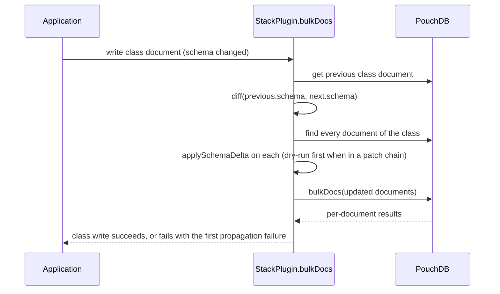

A class is a schema for documents that already exist, so a change to a class document must reach them. This page describes the code path as it is today, for anyone changing it.

## Where it runs

Propagation runs **inside the write of the class document**, in the `bulkDocs` override of the stack plugin (`packages/client/src/plugins/pouchdb.ts`, the branch for documents whose `~class` is `class`). It is synchronous with the write: the class document and its consequences land in the same call, and a failure in the consequences fails the write.

The steps, in order:

1. **Fetch the previous version** of the class document. Its absence is what "just created" means. A revision count is not: a stored class at revision 1 receiving its first schema change already has documents to propagate to, and an older check on `_revisions.ids.length` skipped exactly that write.
2. **Build a detached `Class`** from the previous model (`Class.buildFromModel(stack, previous, { subscribe: false })`), used only for diffing and applying the delta.
3. **Diff** `previous.schema` against `doc.schema` with `jsondiffpatch`. No delta, nothing to do.
4. **Read every document of the class** with a raw `db.find` on `{ '~class': name, active: true }`, not through `getCards`: propagation must see every document, not a session's filtered subset, and it runs during `create()`'s patch application before any session exists. When the class encrypts and the stack holds the key, the documents are decrypted first; a keyless encrypting class never reaches here, because its patch was deferred upstream.
5. **Skip batch-mates.** A document that is also in the batch being written (a `preApply` job's massage, for instance) belongs to the batch, not to propagation: its batch version is validated against the batch model by the document branch, and judging the stale committed copy here would refuse or undo what the massage fixed.
6. **Apply the delta** to each document with `applySchemaDelta(doc, delta, classObj, nextSchema)` from `packages/client/src/utils/index.ts`.
7. **Write the updates back** in one `bulkDocs`, and fail the class write if any document failed: PouchDB reports per-document failures in the resolved array, not by rejecting, so awaiting alone would let a conflicted update silently drop one document's propagation.

## `applySchemaDelta`

Every entry of the delta applies. `jsondiffpatch` emits three array shapes and one nested shape, and the function handles all four:

| Delta shape | Meaning | Effect on the document |
| :--- | :--- | :--- |
| `[new]` | An attribute was added. | Stamp the default where the key is absent; held values survive. |
| `[old, new]` | An attribute was replaced wholesale. | Validate the document against the **new** model; refuse if it cannot satisfy it. |
| `[old, 0, 0]` | An attribute was removed. | Delete the key. |
| a nested object | An attribute model was edited in place, one config flag or a description. | The ordinary shape of an edit. The delta carries only the changed fragment, so the full model to validate against comes from the schema being written (`nextSchema`). |

The function used to `return` from inside its loop, so a change touching several attributes propagated at most one, chosen by key order; and it had no branch for the nested shape, so an in-place edit never applied at all. Both are fixed and pinned.

## In a patch chain

The chain stages its class models through an internal transaction and runs the same diff-and-apply **dry** against the staged models before anything commits (`ClientStack`, the propagation dry-run step): every document of every changed class is read, decrypted if needed, and run through `applySchemaDelta`, with nothing kept. A refusal names the patch, class and attribute. The commit then writes the class documents through the plugin, where the real propagation above runs.

## The lock

While a propagation is in flight, `class-model-propagation-pending` writes a `~lock-propagation-<class>` document (class `~lock`) and the in-memory `Class` marks itself busy, holding off further model changes to that class. `class-model-propagation-complete` clears both. The lock is device-local: `~lock-` ids and the `~lock` class are on the internal-document list and never replicate.

## The design that was not built

An earlier design moved propagation into a Web Worker with its own PouchDB instance and a FIFO queue, so that diffing and rewriting thousands of documents would not block the main thread. The worker script still exists at `packages/client/src/workers/dataModel.ts` with its queue scaffolding, and `ClientStack` still carries a `modelWorker` member, but the worker is never constructed: the `new Worker(...)` line and the `onmessage` wiring in `setListeners` are commented out, and the queue's processing body is empty. Propagation runs on the main thread, inside the write, which is what makes it transactional with the class document and with a patch chain. Moving it off-thread again would have to preserve that property.

The decisions are [ADR-0036](https://github.com/onyx-og/docstack/blob/main/specs/adr/0036-applyschemadelta-applies-one-attribute.md) (the finding) and [ADR-0038](https://github.com/onyx-og/docstack/blob/main/specs/adr/0038-a-class-patch-merges-schema-null-drops-an-attribute.md) (the fix and the merge rule).
